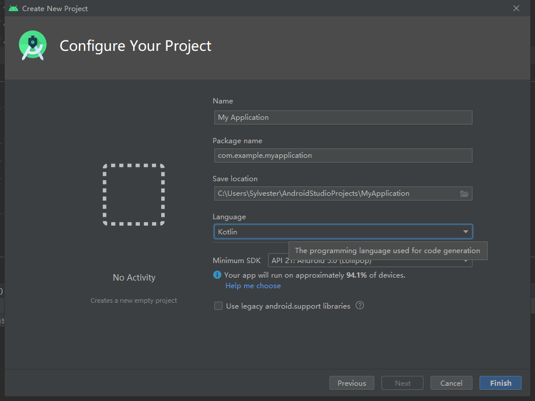

# Kotlin 急速入门

## 开发环境

Android Studio 3.0+ 内置 Kotlin 编译环境，新建项目时选择 Kotlin 语言即可开始使用 Kotlin 编码：



当然，[其它的方式](https://www.kotlincn.net/docs/tutorials/jvm-get-started.html)也可以将 Kotlin 代码运行起来。

又或者你想在已有的 Android 项目中直接使用它，并体验 Kotlin 与 Java 的互操作，可以这样：


创建一个子模块，选择 Java or Kotlin Library，下一步选择 Kotlin 语言，创建模块，Android Studio 将自动导入 Kotlin 依赖环境，Gradle 同步成功便可开始编码。

## 源码布局

与 Java 相似，Kotlin 目录结构以包的形式组织，不同的是 Java 源码文件 `.java` 约束文件内的顶层一定是一个类，并且类名与文件名要相同，而 Kotlin 的源码文件 `.kt` 没有这个约束，文件的顶层不必是一个类，即便是一个类，其类名和文件名亦可不同（但为了阅读性一般不这么做）。

这是一个例子：

- Java

```Java
// Main.java

public class Main {
    public static void main(String[] args) {
        System.out.println("Java");
    }
}
```

- Kotlin

```Kotlin
// Main.kt

fun main(args: Array<String>) {
    println("Kotlin")
}
```

## 顶层属性和方法

在上面的 Kotlin 源码中，出现了一种在文件中直接编写方法的情形，这样的方法在 Kotlin 编码中是被允许并且有一个专用的名称叫**顶层方法（Top-level function）**。同时，Kotlin 还支持**顶层属性（Top-level property）**，写法如下：

```Kotlin
// Main.kt

// 顶层属性
val language: String = "Kotlin"

// 顶层方法
fun main(args: Array<String>) {
    println(language)
}
```

顶层属性和方法的语义，相当于 Java 类的 `static` 属性和方法，在使用时不需要创建对象来调用。当然，顶层没有所谓的类来包裹它们，也就没有创建对象的可能，它们是归属于当前包的，也就是说，在同一个包下，有两个不同文件定义了同名的顶层属性或相同函数签名的方法是会出现冲突的。当冲突发生，IDE 会智能地给出提示，所以也不必担心。

## 变量声明

```Kotlin
val language: String = "Kotlin"
```

在定义一个变量时，有两个关键字可以选用 `val` 与 `var`。`val` 可以看作是 value，不可变变量；`var` 可以看作是 variable，可变变量。关键字后跟着的是名称，之后用冒号 `:` 分离变量名和变量类型，最后对变量赋值。来看看 Java 和 Kotlin 的对等写法：

- Java

```Java
final int immutable = 0;
// immutable = 1 // 报错，immutable 被 final 修饰不可变更

int mutable = 0;
mutable = 1; // 可以
```

- Kotlin

```Kotlin
val immutable: Int = 0
// immutable = 1 // 报错， 声明为 val 不可变更
var mutable: Int = 0
mutable = 1 // 可以, 声明为 var 可以被重新赋值
```

特别地，Kotlin 有强大的类型推断能力，当编译器可以根据赋值推断出类型时，显示的类型声明可省略不写：以及语句结束时的分号 `;` 也是可以省略的。

```Kotlin
val int = 0 // 自动推导出 Int
val double = 0.0 // 自动推导出 Double
val float = 0.0f // 自动推导出 Float
```

## 类型

Kotlin 是静态类型的语言，也就是和 Java 一样是强类型的，类型在声明时就确定下来了，尽管有时候它的写法像弱类型语言那样，这完全是得益于强大的类型推导能力，小心被语法误导。

### 数字型

- Byte
- Short
- Int
- Long
- Float
- Double

Java 中有分基本类型和包装类型，而在 Kotlin 这样的分法被摈弃，统一了写法。这并不是说，它完全地使用包装类型，这样做显然会影响性能，其他它最终在编译时是会根据使用场景，自动识别使用基础类型还是包装类型。一般使用包装类型的地方有：可空类型、泛型。

### 布尔型

- Boolean

### 字符型

- Char

### 字符串

- String

字符串的用法大体与 Java 无异，有两个高效的使用方式是：

1. 字符串模板

    使用 `+` 做多字符串拼接，有时会变得臃肿，不直观，或者使用 `String.format()` 写起来繁琐，那么可以考虑字符串模板的语法：

    ```Kotlin
    val user: String = "Sly"
    val language: String = "Kotlin"

    fun main(args: Array<String>) {
        println("Hello, ${user}! Thanks for using ${language}.")
    }

    // 输出：
    // Hello, Sly! Thanks for using Kotlin.
    ```

2. 三引号字符串

    多行文本，保留字符串格式和排版：

    ```Kotlin
    fun main(args: Array<String>) {
        println(
            """
            
            "Hello Kotlin!"
            
            | |     //
            | |   // 
            | | //      
            | |/\\      ======
            | |   \\      ||
            | |     \\    ||    ?:
            
        """.trimIndent()
        )
    }
    ```

### 可空类型

可空类型即是在类型的后面再加上 `?` 构成的一个类型，例如：

```Kotlin
var user: String = "Non-null"
// user = null // 报错，变量不可空，不可赋值为 null

var nullableUser: String? = "Nullable"
nullableUser = null // 成功
```

不可空类型旨在消除 Java 中频频出现的 `null` 检查以及不可预期的 `NullPointerException` 异常。为了处理可空类型，Kotlin 还开发了一套专用的操作符来使用可空性：

1. `?.` 安全调用
2. `?:` Elvis 操作
3. `!!` 非空断言

```Kotlin
var name: String? = null

// 报错，name 为可空类型，不可直接使用
// val length0: Int? = name.length

// ?. 安全调用，当 name 为空时直接返回 null， 不为 null 时进行取值
val length1: Int? = name?.length

// ?: Elvis，操作符前的结果不为 null 直接返回前面运算的结果
// 前者运算结果为 null，则返回后面的结果，这里是 0 
val length2: Int = name?.length ?: 0 

name = "Sly"
// !! 非空断言后强制调用，如果为空抛出 NullPointerException
val length4 = name!!.length
```

### 数组

数组有一个专用的类型表示：`Array`。在最开始的 `main` 方法中出现过数组 `Array<String>`，对应了 Java 的 `String[]` 写法，所以数组被一个专门设计的类型所表示，已达到更一致的面向对象语法。这里 `Array` 是带有尖括号 `<>` 的，也就是说，它用到了泛型。那么在使用 `Array<Int>`，`Array<Boolean>`，`Array<Char>`等等，转译成字节码就会采用包装类型。为了性能考虑，Kotlin 提供了几个特殊的数据类型，来对应 Java 中的基本类型的数组。

- ByteArray
- ShortArray
- IntArray
- LongArray
- FloatArray
- DoubleArray
- BooleanArray
- CharArray

数组的创建有多种方式，一般推荐使用标准库中定义的顶层工厂方法来创建同时直接赋值：

```Kotlin
val users: Array<String> = arrayOf<String>("A", "B", "C")
val areas: LongArray = longArrayOf(4, 6, 9, 12)
```

也可以调用构造函数，创建一个指定大小的数组，之后再逐一赋值：

```Kotlin
val heights = FloatArray(10)
```

请看这里的对象创建是不需要 `new` 关键字的。

### 集合类型

- List
  - listOf()
  - mutableListOf()
- Set
  - setOf()
  - mutableSetOf()
- Map
  - mapOf()
  - mutableMapOf()

在集合中，经典的集合类型有 `List`、`Set`、`Map`。值得注意的是，集合类型也被分为了可变和不可变两种，不可变集合在创建后便是只读的，不可以对集合内的数据进行修改。

## 函数

## 流程控制

## 类、对象和接口