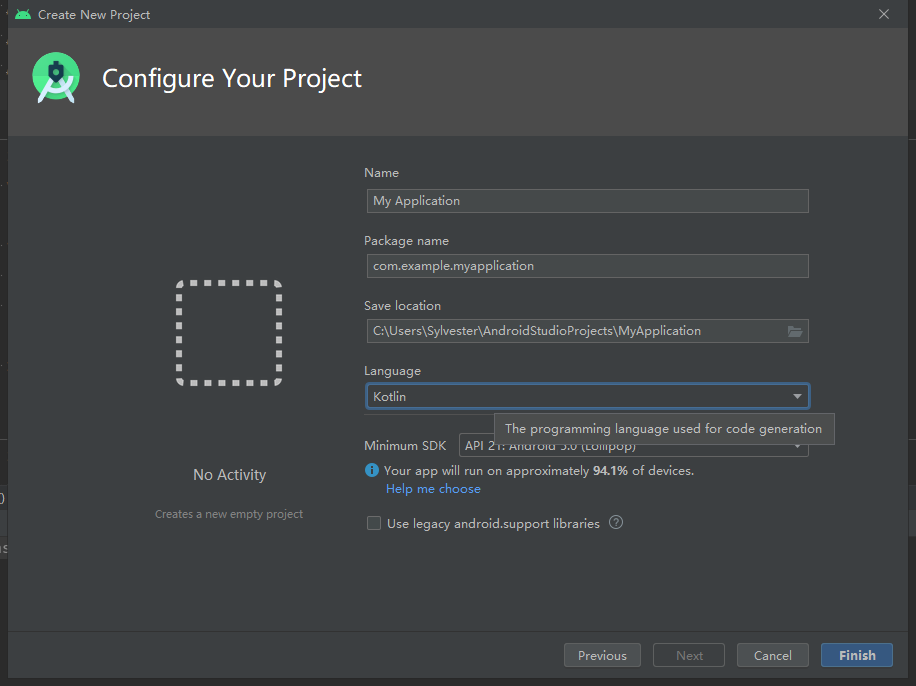
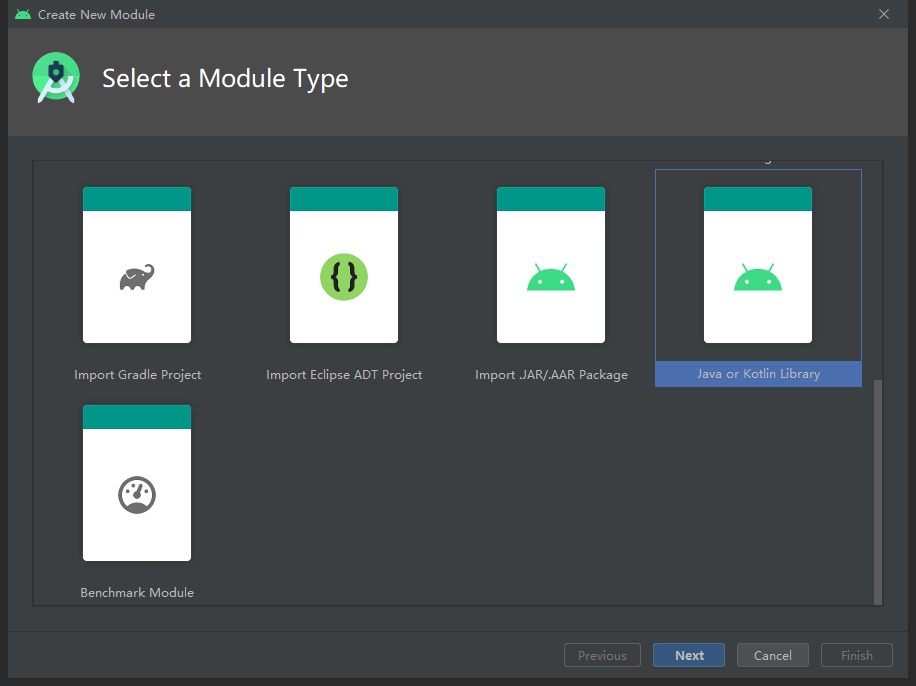

# Android 工程师 Kotlin 急速入门

## 开发环境

Android Studio 3.0+ 内置 Kotlin 编译环境，新建项目时选择 Kotlin 语言即可开始使用 Kotlin 编码：



当然，[其它的方式](https://www.kotlincn.net/docs/tutorials/jvm-get-started.html)也可以将 Kotlin 代码运行起来。

又或者在已有的 Android 项目中直接使用它，并体验 Kotlin 与 Java 的互操作：



创建一个子模块，选择 Java or Kotlin Library，下一步选择 Kotlin 语言，创建模块，Android Studio 将自动导入 Kotlin 依赖环境，Gradle 同步成功便可开始编码。

## 源码布局

与 Java 相似，Kotlin 目录结构以包的形式组织。不同的是，Java 源码文件 `.java` 约束文件内的顶层一定是一个类，并且类名与文件名相同；而 Kotlin 的源码文件 `.kt` 没有这个约束，文件的顶层不必是一个类，即便是一个类，其类名和文件名亦可不同（但为了便于维护一般不这么做）。

从 main 入口举一个例子：

- Java

```Java
// Main.java

public class Main {
    public static void main(String[] args) {
        System.out.println("Java");
    }
}
```

- Kotlin

```Kotlin
// Main.kt

fun main(args: Array<String>) {
    println("Kotlin")
}
```

## 顶层属性和函数

在上面的 Kotlin 源码中，出现了一种在文件中直接编写函数的情形，这样的函数在 Kotlin 编码中是被允许的，而且有一个专用的名称叫**顶层函数（Top-level function）**。同时，Kotlin 还支持**顶层属性（Top-level property）**。二者写法如下：

```Kotlin
// Main.kt

// 顶层属性
val language: String = "Kotlin"

// 顶层函数
fun main(args: Array<String>) {
    println(language)
}
```

顶层属性和函数的语义，相当于 Java 类的 `static` 属性和方法，在使用时不需要创建对象来使用它们。当然，顶层没有所谓的类来包裹它们，也就没有创建对象的可能。它们是直属于当前包级的，不以文件区分，所以应当注意同包不同文件的同名冲突。

## 变量声明

```Kotlin
val language: String = "Kotlin"
```

在定义一个变量时，有两个关键字可以选用 `val` 与 `var`。`val` 可以看作是 value，表示只读变量；`var` 可以看作是 variable，表示可变变量。关键字后跟着变量名称，之后用冒号 `:` 分离变量名和变量类型，最后对变量进行初始化。Kotlin 奉行声明立即初始化的原则，通常看到变量都会跟着 `=` 直接赋值。对比 Java 和 Kotlin 变量声明的写法：

- Java

```Java
final int immutable = 0;
// immutable = 1 // 报错，immutable 被 final 修饰不可变更

int mutable = 0;
mutable = 1; // 可以
```

- Kotlin

```Kotlin
val immutable: Int = 0
// immutable = 1 // 报错， 声明为 val 不可变更

var mutable: Int = 0
mutable = 1 // 可以, 声明为 var 可以被重新赋值
```

特别地，Kotlin 有强大的类型推断能力，当编译器可以根据赋值推断出类型时，显式的类型声明可省略不写。以及语句结束时的分号 `;` 也是可以省略的。

```Kotlin
val int = 0 // 自动推断出 Int
val double = 0.0 // 自动推断出 Double
val float = 0.0f // 自动推断出 Float
```

## 类型

Kotlin 是静态类型的语言，也就是和 Java 一样的强类型。变量的类型在声明时就确定下来了，尽管它是以 `val`、`var` 开头来声明变量。这是类型后置和强大的类型推断能力同时作用造成的假象。

### 数字型

- `Byte`
- `Short`
- `Int`
- `Long`
- `Float`
- `Double`

Java 中有分基础类型和包装类型，而 Kotlin 摈弃这样的区分，统一了写法。这并不是说，它完全地使用包装类型，这样做显然会影响性能。其实，它最终在编译时会根据使用场景，自动识别使用基础类型还是包装类型。一般使用包装类型的情况有：[可空类型](#可空类型)、泛型。

#### 数字类型的操作符

- 加/减/乘/除/模
- 位与 `and`
- 位或 `or`
- 异或 `xor`
- 按位取反 `inv`
- 左移 `shl`
- 右移 `shr`
- 无符号右移 `ushr`

例，一个长度为 4 的 Byte 数组以小端序表示一个 Int 值，将这个数组转换为数值：

```Kotlin
val data = byteArrayOf(0xFF.toByte(), 0xFF.toByte(), 0x00, 0x00)

val result = (data[3].toInt() and 0xFF shl 24) or
        (data[2].toInt() and 0xFF shl 16) or
        (data[1].toInt() and 0xFF shl 8) or
        (data[0].toInt() and 0xFF)

// result = 65535 (0x0000FFFF)
```

### 布尔型

- `Boolean`

#### 布尔类型的操作符

- 与：`&&`
- 或：`||`
- 非：`!`

### 字符型

- `Char`

### 字符串

- `String`

字符串的用法大体与 Java 无异，有两个被强化的使用方式是：

1. 字符串模板

    使用 `+` 拼接多个字符串，有时会变得臃肿，肮脏。而使用 `String.format()` 写起来繁琐，那么可以考虑字符串模板的语法：

    ```Kotlin
    val user: String = "Sly"
    val language: String = "Kotlin"

    fun main(args: Array<String>) {
        println("Hello, ${user}! Thanks for using ${language}.")
    }

    // 输出：
    // Hello, Sly! Thanks for using Kotlin.
    ```

2. 三引号字符串

    多行文本，保留字符串格式和排版：

    ```Kotlin
    fun main(args: Array<String>) {
        println(
            """
            
            "Hello Kotlin!"
            
            | |     //
            | |   // 
            | | //      
            | |/\\      ======
            | |   \\      ||
            | |     \\    ||    ?:
            
        """.trimIndent()
        )
    }
    ```

### 可空类型

可空类型是 Kotlin 具备安全编码特性的一种体现。该类型的表示法是在原类型的后面再加上问号 `?` 组合成复合形态，例如：

```Kotlin
var user: String = "Non-null"
// user = null // 报错，变量不可空，不可赋值为 null

var nullableUser: String? = "Nullable"
nullableUser = null // 成功
```

引入可空类型，旨在消除 Java 中频频出现的 `null` 检查以及不可预期的 `NullPointerException` 异常。通过查看类型符号，能够轻易地被识别数据会不会产生 `null`。Kotlin 的语言设计中，非空类型写出来直观顺手，而可空类型在声明时便需要有意识地加上 `?` 标记，促使开发者更细心甄别是否值得引入可空性。

为了处理可空类型，Kotlin 还开发了一套专用的操作符来操作它：

1. `?.` 安全调用
2. `?:` Elvis 操作
3. `!!` 非空断言

```Kotlin
var name: String? = null

// val length0: Int? = name.length
// 报错，name 为可空类型，不可直接使用

val length1: Int? = name?.length
// ?. 安全调用，当 name 为 null 时直接返回 null，不为 null 时进行取值

val length2: Int = name?.length ?: 0
// ?: Elvis 操作符前的结果不为 null 直接返回前面运算的结果
// 前者运算结果为 null，则返回后面的结果，这里的结果是后者的 0 值 

name = "Sly"
val length4 = name!!.length
// !! 非空断言后强制调用，如果对象为空抛出 NullPointerException
```

### 数组

数组有一个专用的类型表示：`Array`。在最开始的 `main` 函数中出现过一类数组 `Array<String>`，对应了 Java 的 `String[]`。所以 Kotlin 类型系统中，数组被一个专门设计的类所表示，以达到更一致的面向对象语法。这里 `Array` 带有尖括号 `<>` ，也就是说，它用到了泛型。那么使用 `Array<Int>`，`Array<Boolean>`，`Array<Char>`等数组，转译成字节码就会采用包装类型。为了性能考虑，Kotlin 提供了几个特殊的数据类型来对应 Java 中的基础类型的数组。

- ByteArray
- ShortArray
- IntArray
- LongArray
- FloatArray
- DoubleArray
- BooleanArray
- CharArray

数组的创建有多种方式，一般推荐使用标准库中定义的顶层工厂方法来创建：

```Kotlin
val users: Array<String> = arrayOf<String>("A", "B", "C")
val areas: LongArray = longArrayOf(4, 6, 9, 12)
```

也可以调用构造函数，创建一个指定大小的数组，之后再逐一赋值：

```Kotlin
val heights = FloatArray(10)
```

值得注意的是，Kotlin 中的对象创建不需要 `new` 关键字，直接由类名加上括号 `()` 并传入构造函数参数，看上去就像是调用构造函数生产了一个对象。

### 集合类型

- List
  - 只读类型 List: `listOf()`
  - 可变类型 MutableList: `mutableListOf()`, `arrayListOf()`
- Set
  - 只读类型 Set: `setOf()`
  - 可变类型 MutableSet: `mutableSetOf()`, `hashSetOf()`, `linkedSetOf()`, `sortedSetOf()`
- Map
  - 只读类型 Map: `mapOf()`
  - 可变类型 MutableMap: `mutableMapOf()`, `hashMapOf()`, `linkedMapOf()`

在集合中，经典的集合类型有 `List`、`Set`、`Map`。值得注意的是，集合类型也被分为了可变和只读两种。只读集合在创建后便不能修改、删除、增加元素，标准库的接口也没有这类方法；可变类型与 Java 中常用的集合类相似。所以使用 Java 集合类型创建出来的对象属于可变集合。不可变数据的天生优势是线程安全，不会产生一致性问题。

### 类型检查

- `is`：对应 Java 的 instanceof
  - 智能类型转换
- `as`：强制类型转换
- `as?`：安全类型转换

## 函数

```Kotlin
fun greeting(name: String): String {
    return "Hello $name"
}
```

逐步将函数拆解开：`fun` 关键字用于声明函数，紧接着是函数名、圆括号包裹的函数参数、函数返回值类型、函数体。

函数参数的写法和变量声明类似，但不需要 `val`、`var` 关键字，参数名和参数类型用 `:` 隔开，多个参数用 `,` 分隔。函数的参数是可以带有默认值的，这样的函数在调用时，若不给具有默认值的参数实际值，那么函数运行时就会使用默认值：

```Kotlin
fun add(value: Int, increment: Int = 1): Int {
    return value + increment
}

add(1) // 1 + 1
add(1, 3) // 1 + 3
```

这就像是 Java 中的方法重载一样，只是 Java 需要写两个方法，Kotlin 中合并为一个。

更进一步，Kotlin 函数调用时可以指定参数名称传值：

```Kotlin
add(value = 1) // 1 + 1
add(value = 1, increment = 3) // 1 + 3
add(increment = 3, value = 1) // 1 + 3
```

具名参数形式的调用可以不按照函数声明的参数顺序来传值。当函数具有多个参数时，具名参数传值更能明确语义。

另外，还有一种函数参数是可变参数，让函数支持任意数量的参数。拿 `List` 其中一个静态工厂举例：

```Kotlin
fun <T> listOf(vararg elements: T): List<T> { /*内部省略*/ }
```

用 `vararg` 关键字声明的参数，就表示调用时可以一次传入多个参数。用法举例：

```Kotlin
fun main(args: Array<String>) {
    listOf('a', 'b', 'c') // List<Char>

    listOf(args) // List<Array<String>>
    listOf(*args) // List<String>
}
```

要想将一个数组的所有值传递给一个可变数量参数的函数，需要在传入参数时用 `*` 展开数组。

函数的返回值类型紧跟在函数签名的末尾，同样用 `:` 隔开签名和类型。有种情况，如上面的 main 函数，它并没有声明函数返回值的类型，这是因为它没有返回值。Java 中用 `void` 表示函数没有返回值，Kotlin 中函数没有返回值是用 `Unit` 表示。完整的 main 函数应这样写：

```Kotlin
fun main(args: Array<String>): Unit {
}
```

出于简化目的，`: Unit` 可以省略不写，并且省略写法依然明确传达这个函数没有返回值的语义，不会造成混淆。

对于函数体，通常情况下，它被大括号包裹；当函数体只有一个表达式时，可用 `=` 连接函数签名和表达式，略去大括号。例如，main 函数可改写为：

```Kotlin
fun main(args: Array<String>) = println("Kotlin")
```

上面的 add 函数可以改写为：

```Kotlin
fun add(value: Int, increment: Int = 1): Int = value + increment
```

还能够做到更简练，在通过函数体表达式可以准确推断出函数返回类型时，显式的返回值类型声明亦可省略不写：

```Kotlin
fun add(value: Int, increment: Int = 1) = value + increment
```

当然，这中间写与不写的道义，还需视具体情况甄别。

## 流程控制

### if

条件判断。用法同 Java。同样的 `&&` 或 `||` 运算符存在短路规则。

不同的是 Kotlin 没有三目运算符，取而代之的是 if 表达式：

- Java

```Java
final String description = seconds > 60 ? "more than one minute" : "coming soon";
```

- Kotlin

```Kotlin
val description: String = if (seconds > 60) "more than one minute" else "coming soon"
```

可以发现，`if...else...` 代码块直接赋值给一个变量，变量被赋予的值就是代码块执行的结果。这里 if 和 else 下的各只有一个语句，所以可以省略大括号 `{}`。并且故意压缩为一行，使得结构上更接近 Java 的三目运算符，但为了更好的可维护性，一般建议加上 `{}`，并优化代码排版。

```Kotlin
val description = if (seconds > 60) {
    println("${seconds/60} minutes")
    "more than one minute"
} else {
    println("$seconds seconds")
    "coming soon"
}
```

`if...else...` 这种带有返回值的表达式并没有被约束只容许写一行代码，多行代码的情况下，取各分支代码块最后一行的运算结果作为返回值。

### when

Kotlin 中的 `when` 类似于 Java 中的 `switch`，又青出于蓝，极其擅长处理多分支操作：

```Kotlin
val name = when (androidApi) {
    30 -> { "Android 11" }
    29 -> { "Android 10" }
    28 -> { "Pie" }
    27, 26 -> { "Oreo" }
    25, 24 -> { "Nougat" }
    23 -> { "Marshmallow" }
    22, 21 -> { "Lollipop" }
    in 0..20 -> error("It is too old to identify")
    else -> error("Not launched yet")
}
```

`when` 的写法具有一定的结构模式，`when` 关键字后面可以跟随一个圆括号包裹的参数作为匹配数据来源，再加上匹配代码块，每一个分支都用 `->` 连接匹配条件和分支代码块，分支代码块以大括号 `{}` 包裹，单行时可省略 `{}`。一旦有分支被匹配，就不会再去判断其他分支，直接执行匹配的代码块后返回。

与 if 相同的一点是，when 也可以作为带返回值的表达式，直接赋值给变量。在 when 中，多个分支具有相同匹配，可以将条件合并，以逗号 `,` 分隔。倒数第二行的 `in 0..20` 表示的是匹配 0 到 20 范围内的数值。`..` 创建了一个 `IntRange` 范围类型的对象，使用操作符 `in` 可以判断值是否落在范围内。`error` 函数是标准库内建的工具函数，用于抛出异常。抛出异常的语句可以看作是返回值为 `Nothing` 的表达式，而 `Nothing` 是所有类型的子类，可以和其他分支的类型相容。最后的 `else` 在以上所有分支都没有匹配时执行。

when 还有另一种不带参数的写法：

```Kotlin
val desc = when {
    androidApi >= 23 && androidApi <= 30 -> { "Modern SDK" }
    androidApi in 15..22 -> { "Legacy SDK" }
    androidApi < 15 -> { "Out of date SDK" }
    else -> { "Not launched SDK" }
}
```

不带参数的匹配形式，风格更加随意，甚至分支不必有逻辑联系，只是将代码组织成块。

### 循环

- while
- do...while
- for...in

`while` 与 `do...while` 用法与 Java 无异，`for` 循环则有所不同：

- Java

```Java
for (char element : "This is a String".toCharArray()) {
    System.out.println(element);
}
```

- Kotlin

```Kotlin
for (element: Char in "This is a String") {
    println(element)
}
```

Kotlin 中的 `Iterable` 对象均可直接用 `for...in...` 遍历，还可以扩展出更多样的遍历方式：

```Kotlin
// 带索引的遍历
for ((index: Int, element: Char) in "This is a String".withIndex()) {
    println("No.$index -> $element")
}

// Map.Entry 解构
val map = mapOf("A" to 0, "B" to 1, "C" to 2)
for ((key, value) in map) {
    println("$key -> $value")
}

for (i in 0..10) {} // 0 到 10
for (i in 0 until 10) {} // 0 到 9
for (i in 0..10 step 4) {} // 0，4，8
for (i in 10 downTo 0 step 4) {} // 10，6，2
```

以及更多关于范围区间的知识，[参考官网](https://www.kotlincn.net/docs/reference/ranges.html)

### 实战

结合变量、函数、流程控制做一个实例，判断字符串是否为纯数字（这里只做语法练习，不考虑性能和特殊字符）：

1. 对单个字符判断是否落在数字字符范围内：

    ```Kotlin
    fun isDigit(char: Char): Boolean {
        return when (char) {
            in '0'..'9' -> true
            else -> false
        }
    }
    ```

2. 遍历字符串，校验每一个字符：

    ```Kotlin
    fun isDigitsOnly(string: String): Boolean {
        var result = true

        for (char in string) {
            result = result && isDigit(char)
        }

        return result
    }
    ```

3. 输出样例：

    ```Kotlin
    fun main(args: Array<String>) {
        isDigitsOnly("123456098") // true
        isDigitsOnly(" 0") // false
    }
    ```

## 类、对象和接口

面向对象编程的概念是通用的，Java 有的面向对象特性同样可以在 Kotlin 中延用。

取一个 Kotlin 标准库中的类，来分析类定义的书写方式：

```Kotlin
public class IntRange(start: Int, endInclusive: Int) : IntProgression(start, endInclusive, 1), ClosedRange<Int> { /*内部省略*/ }

public open class IntProgression internal constructor(start: Int, endInclusive: Int, step: Int) : Iterable<Int> { /*内部省略*/ }

public interface ClosedRange<T: Comparable<T>> { /*内部省略*/ }
```

从这里可以延展出以下几点：

1. 可见性修饰符；
2. open、final 和 abstract 修饰符；
3. 主构造函数；
4. 类的继承；
5. 接口的实现；

### 可见性修饰符

以表格形式，列举不同可见性修饰符作用于类成员和顶层属性/函数时的可见性效果：

| 修饰符         | 类成员       | 顶层声明     |
| -------------- | ------------ | ------------ |
| public（默认） | 所有地方可见 | 所有地方可见 |
| internal       | 模块内可见   | 模块内可见   |
| protected      | 子类内可见   | -            |
| private        | 类内可见     | 文件内可见   |

其中 public 为默认修饰符，没有指定可见性时，就是 public 可见。Kotlin 中没有包内可见的概念。

### open、final 和 abstract 修饰符

`open`、`final` 和 `abstract` 这些关键字是可以控制继承的修饰符，上面的代码块中 `IntRange` 没有被修饰，是使用了默认 final 修饰，表示这个类不能被继承；`IntProgression` 用 open 修饰，表示这个类可以被继承；还有一种可以被继承的类是抽象类，用 abstract 修饰。

与普通类使用 open 修饰开放继承不同的是，抽象类不能被直接实例化，并且可以有抽象成员，这在模板方法模式中非常有用。下面列举这些修饰符作用于类成员时的约束：

| 修饰符   | 相关成员               | 评注                                         |
| -------- | ---------------------- | -------------------------------------------- |
| final    | 不能被重写             | 类中成员默认使用                             |
| open     | 可以被重写             | 需要明确地表明                               |
| abstract | 必须被重写             | 只能在抽象类使用；抽象成员不能有实现         |
| override | 重写父类或接口中的成员 | 如果没有使用 final，被重写的成员默认是开放的 |

### 主构造函数、初始化语句块和次构造函数

在 `IntRange` 类名后，圆括号包裹的代码块是主构造函数，它是构造函数的一种简略写法，完整写法如下：

```Kotlin
public class IntRange constructor(start: Int, endInclusive: Int) : IntProgression(start, endInclusive, 1), ClosedRange<Int> { /*内部省略*/ }
```

Kotlin 中的构造函数并不是一类与类名同名的函数，而是使用 `constructor` 命名的函数。像 `IntProgression` 那样主构造函数需要用非 public 修饰符修饰时，构造函数名称 `constructor` 不能被省略。常用的单例模式，通过隐藏构造函数来保证只在类内部创建实例，就需要 `private constructor`。

再来展开 `IntProgression` 类的代码：

```Kotlin
public open class IntProgression
    internal constructor(start: Int, endInclusive: Int, step: Int) : Iterable<Int> {

    init {
        if (step == 0) throw kotlin.IllegalArgumentException("Step must be non-zero.")
        if (step == Int.MIN_VALUE) throw kotlin.IllegalArgumentException("Step must be greater than Int.MIN_VALUE to avoid overflow on negation.")
    }

    public val first: Int = start

    public val last: Int = getProgressionLastElement(start.toInt(), endInclusive.toInt(), step).toInt()

    public val step: Int = step

    /*部分省略*/
}
```

初始化语句块就是这里被 `init` 包裹的代码块，它会在主构造函数结束后执行，如果类中有多个 init 块，它们是从上到下依次执行的。初始化块的作用是对主构造函数的补充，放置更加复杂的代码逻辑，如上面的参数合法性校验，或者复杂成员的初始化等等。

还有一点需要注意的是，例子中主构造函数的 `start`，`endInclusive`，`step` 三个参数是仅初始化可见的，在成员函数中无法访问他们，所以这里在成员属性初始化时做值传递。如果想直接将主构造函数的参数作为成员属性，那么要在参数前添加 `val` 或 `var` 关键字。这样创建对象时，主构造函数会直接将参数赋值给成员。此时可见性修饰符也可以配合使用，如：

```Kotlin
public open class IntProgression internal constructor(
        private val start: Int,
        private val endInclusive: Int,
        private val step: Int
) : Iterable<Int> {}
```

次构造函数可用来提供一种不同形式的对象构建方式。定义次构造函数需要遵守的一条规则是调用主构造函数，这样做可以在一定程度上保证对象创建行为的一致性：

```Kotlin
public open class IntProgression
    internal constructor(start: Int, endInclusive: Int, step: Int) {

    // 次构造函数，调用主构造函数
    constructor(range: IntRange, step: Int = 1): this(range.first, range.last, step)
}
```

构造函数结合使用默认参数，可以达到类似 Java 层叠构造方法的效果。

### 类继承和接口实现

类继承的写法是用 `:` 连接子类和父类，接口的实现也是同样的写法。区分类继承还是接口实现，仅在于类继承要调用父类的构造函数，而接口实现则只写接口名。取来 `IntRange` 的源码看看：

```Kotlin
public class IntRange(start: Int, endInclusive: Int) : IntProgression(start, endInclusive, 1), ClosedRange<Int> {
    override val start: Int get() = first
    override val endInclusive: Int get() = last

    override fun contains(value: Int): Boolean = first <= value && value <= last

    override fun isEmpty(): Boolean = first > last

    override fun equals(other: Any?): Boolean =
        other is IntRange && (isEmpty() && other.isEmpty() ||
        first == other.first && last == other.last)

    override fun hashCode(): Int =
        if (isEmpty()) -1 else (31 * first + last)

    override fun toString(): String = "$first..$last"

    companion object {
        /** An empty range of values of type Int. */
        public val EMPTY: IntRange = IntRange(1, 0)
    }
}
```

IntRange 类继承了 IntProgression 类并实现了 ClosedRange 接口。继承 IntProgression 要求调用它的构造函数，类似于 Java 中调用 `super` 父构造器。

Kotlin 继承链中，所有不可空类型的祖先类是 `Any`，`Any` 的父类是 `Any?`。`Any?` 对应 Java 中的 `Object`，但比 `Object` 少了 `wait`，`notify`，`notifyAll` 方法。

接口内可以声明属性和函数，属性不能赋值，函数可以有具体的函数体实现。这样的语言特性使得接口和抽象类在使用方式上更加相近，主要的抉择依据也就更偏向 Kotlin 的单继承模型是否会阻碍代码扩展性。

### 类成员

上面的 IntRange 类展示了典型的类成员结构：

- 属性
- 函数
- 伴生对象

#### 属性

由于属性也可以是抽象的，故属性也可以像函数一样被覆盖重写。在 Kotlin 中重写任意属性和函数都要用 `override` 关键字修饰被重写的目标，这比 Java 用 `@Override` 注解要严格，更不容易出现避免纰漏。

属性内建有称为内置访问器的 getter 和 setter 函数，声明为 `var` 的属性同时具有 `get` 和 `set` 两个访问器，声明为 `val` 的属性只有 `get` 访问器。例如 `IntRange` 源码中的 `start` 和 `endInclusive` 两个属性就使用了 `get` 访问器。这样的用法类似 Java 中的 getter，setter 方法，当访问属性时实际上是调用了 `get` 函数，给属性赋值时调用 `set` 函数。

```Kotlin
var language: String = ""
    set(value) {
        if (field.equals(value, ignoreCase = true)) {
            return
        }

        field = value.toUpperCase()
    }
    get() = if (field.isBlank()) {
        ""
    } else {
        field.first().toString()
    }
```

通过自定义属性访问器，可以实现特定规则的赋值和取值。需要注意，访问器内读写属性的当前值使用的是内置的幕后字段，以 `field` 命名，如果使用 `this` 会造成循环调用。

同时，访问器可被可见性修饰符修饰。想象这样一个场景，在 Android 开发中，随时可能使用到 `Context`，但特定的 `Activity` 或 `Service` 随意对外暴露便存在内存泄漏风险，那么就需要全局提供一个 `Application` 级别的上下文供应用内部使用。这种功能的经典实现是创建一个 `Application` 类的子类用于提供上下文：

```Kotlin
// MyApplication.kt
import android.app.Application
import android.content.Context

var globalContext: Context? = null
    private set

class MyApplication : Application() {
    override fun onCreate() {
        super.onCreate()

        globalContext = applicationContext
    }
}
```

可以看到 `globalContext` 的 `set` 访问器用 `private` 修饰，表明 `globalContext` 的赋值只能在当前文件内进行。

先前有提到，Kotlin 语言要求，在声明一般的属性时要同时对其初始化。而 `Application` 创建要在特定的回调之后才能够取得有效 `Context`。那么就需要将 `globalContext` 声明为可空 `Context` 变量并先初始化为 `null`，随后在 `onCreate` 回调中再给它赋予真实的上下文环境。

对可变 `globalContext`，将它的 `set` 访问器的可见性设置为仅文件内可见，能保证其它地方访问 `globalContext` 是只读不可更改的，避免被错误使用。

当然，这段代码还有一个可优化的点：可空性。由于应用运行任意 `Activity` 或 `Service` 组件之前，`Application` 必定已完成 `onCreate` 回调，因此 `globalContext` 在使用时一定是非空的。可是 Kotlin 的语法要求，每一次引用 `globalContext` 都得 `?.` 安全调用，甚至出现 `!!` 非空断言。随着时间的推移，全局使用增加，代码必定变得极其丑陋。

考虑到它的特点是必定会被赋值非空，且赋值只是被推迟到特定的情况又在任何一次调用之前，那么属性延迟初始化是可解救这个困局的：

```Kotlin
lateinit var globalContext: Context
    private set
```

将 `globalContext` 的声明修改为 `lateinit var` 之后，就能够优雅地使用 `Application` 的 `Context` 单例了。

另外，属性还有一种用法是 `by` 委托，作为高级内容，[参考官网](https://www.kotlincn.net/docs/reference/delegated-properties.html)

#### 成员函数

函数此前已经介绍过了，除了前面所介绍的内容，成员函数还有其它值得一说的特性：

1. 中缀表达式

   - 中缀表达式已经在[数字类型](#数字类型的操作符)见识过：`1 shl 8`。移位运算、位运算都使用了中缀表达式，它的特点是让函数调用看起来像是书写运算操作表达式。`1 shl 8` 实际上就是调用了 `shl` 函数，与 `1.shl(8)` 的写法是等价的。这是写法上的革新。
   - 追查 `shl` 函数源码：```public infix fun shl(bitCount: Int): Int```。可以看到它和普通函数一般，唯独函数修饰符多了 `infix`。若想在自定义函数中使用中缀的写法，函数声明时加上这个 `infix` 关键字即可。另一个隐含的条件是 `infix` 修饰的函数只能接收一个参数。

2. 操作符重载

   - 操作符重载和中缀表达式类似，可以简化函数调用。自定义操作符重载后可以在普通类对象上使用如 `+`、`-`、`*`、`/` 等操作。具体内容，不妨[参考官网](https://www.kotlincn.net/docs/reference/operator-overloading.html)

#### 伴生对象

伴生对象是伴随类生成的对象，这类对象中的成员属于类，等价于 Java 类中被 `static` 修饰的成员。它只会在类加载时初始化一次，对类的所有实例对象共享。Kotlin 中没有 `static` 关键字，但可以通过其它手段达到 Java 中静态属性或方法的设计效果，伴生对象便是其一。

`IntRange` 源码中展示了伴生对象的写法 `companion object {}`。伴生对象中还可以定义以 `const` 修饰的常量。

```Kotlin
companion object {
    const val TAG = "NAMED-TAG"
    
    fun newInstance(): Fragment {
        // 具体实现
    }
}
```

#### 内部类和嵌套类

```Kotlin
class Outer {
    internal var something: String? = ""

    // 内部类
    inner class Inner {
        val another: Boolean = something.isNullOrBlank()
        val outer: Outer = this@Outer
    }

    // 嵌套类
    class Nested(outer: Outer) {
         val another: Boolean = outer.something.isNullOrBlank()
    }
}

fun main(args: Array<String>) {
    val out = Outer()
    val inner = out.Inner()
    val nested = Outer.Nested(out)
}
```

1. 内部类

    内部类持有外部类的引用，获取外部类引用是 `this@外部类名`。

2. 嵌套类

    嵌套类和外部类只有位置关系，没有隐式引用联系。

嵌套类和内部类在 Java 与 Kotlin 中的对应关系如下表：

| 类 A 在另一个类 B 中声明   | 在 Java 中     | 在 Kotlin 中  |
| -------------------------- | -------------- | ------------- |
| 嵌套类（不存储外部类引用） | static class A | class A       |
| 内部类（存储外部类引用）   | class A        | inner class A |

### 对象

`object` 关键字，将声明一个类与创建一个实例结合起来。

#### 单例对象

用 `object` 定义一个类时，它同时给这个类创建一个实例。对象声明是创建单例的最简单手段，比如空列表：

```Kotlin
internal object EmptyList : List<Nothing>, Serializable, RandomAccess {
    /* 内部省略 */
}
```

空列表是一个典型的单例应用场景，在处理数据返回一个结果列表时，空结果用这个空列表对象代替，省去新建一个空列表的资源消耗，同时能够代替空对象的角色，简化 null 情况的处理。单例对象内持有的成员亦可类比为静态数据：

```Kotlin
object CardOrganization {
    val icon: Map<String, Int> = mapOf(
            TransactionRecord.CUP to R.drawable.icon_unionpay,
            TransactionRecord.VIS to R.drawable.icon_visa,
            TransactionRecord.MCC to R.drawable.icon_mastercard,
            TransactionRecord.MAE to R.drawable.icon_mastercard,
            TransactionRecord.JCB to R.drawable.icon_jcb,
            TransactionRecord.DCC to R.drawable.icon_dcc,
            TransactionRecord.AMX to R.drawable.icon_amx
    )

    val displayName: Map<String, Int> = mapOf(
            TransactionRecord.CUP to R.string.unionpay,
            TransactionRecord.VIS to R.string.visa,
            TransactionRecord.MCC to R.string.mastercard,
            TransactionRecord.MAE to R.string.mastercard,
            TransactionRecord.JCB to R.string.jcb,
            TransactionRecord.DCC to R.string.dcc,
            TransactionRecord.AMX to R.string.amx
    )
}
```

到目前为止，我们了解，静态数据即可以放置在文件顶层也可以放置在对象声明中，具体选用何种形式则取决于是否需要一个命名空间来明确语义。

#### 对象表达式

对象表达式用来声明匿名对象，对应 Java 中匿名内部类对象的用法。

```Kotlin
edittext.addTextChangedListener(object : TextWatcher {
    override fun afterTextChanged(s: Editable?) {}

    override fun beforeTextChanged(s: CharSequence?, start: Int, count: Int, after: Int) {}

    override fun onTextChanged(s: CharSequence?, start: Int, before: Int, count: Int) {}
})
```

在 Android 开发中，监听 `TextView` 的文本变化需要一个实现 `TextWatcher` 的实例对象，此时对象表达式便大有可用。它创建一个匿名内部类并实例化，实例化的对象可直接传入 `addTextChangedListener` 中，亦可赋值给变量。

### 数据类

`data class` 数据类是一种数据容器，尤其适用在 Bean、Model、Entity 这种数据存储以传输的场景。定义一个数据类：

```Kotlin
data class PackageData(
        val packageName: String,
        val displayName: String,
        val versionName: String,
        val versionCode: Long
)
```

一个极其简短的声明，编译器将会生成许多实用的通用方法：

- equals
- hashCode
- toString
- copy
- componentN

> 不要惊讶这个类如此小，甚至于连类体都没有，这样的写法在 Kotlin 中极其常见，并不是 data class 特有，也不是它已经将类成员属性和主构造函数合并，即便普通类也是允许没有类体的。假设定义一个全局异常，表示建立网络连接失败：
>
> ```Kotlin
> // 全局单例
> object NetworkConnectionException : Exception()
>
> // 带有原因的异常类
> class NetworkConnectionException(override val cause: Throwable) : Exception()
> ```
>
> 类甚至可以极致简短到仅有类声明和类名。

#### equals 和 hashCode

`equals` 在数据类中由编译器自动生成，它重写了默认行为，比较数据的相等性而不是对象地址是否相同。用于比较的数据域是声明在主构造函数中的那些属性。声明在类体内部的属性不会被编译器识别，所以不参与这些通用函数的生成。

对数据类对象的数据域判等，可以直接使用 `==` 操作符；判断内存地址是否相同，使用 `===` 操作符。众类根类 `Any?` 有一个函数签名为 `public open operator fun equals(other: Any?): Boolean` 的函数。这是一个操作符重载的函数，所以用 `==` 比较对象，与调用 `equals` 无异。

遵从《Effective Java》的建议，重写 `equals` 函数，也一定要重写 `hashCode` 函数，保证在如集合类等需要使用对象哈希的场景不会出错。所以数据类型生成 `equals` 函数的同时也生成 `hashCode` 函数。

#### toString

编译器还覆写了数据类的 `toString` 函数，使其打印成员属性，而不再是 `类名@内存地址`。同样，仅主构造函数声明的成员在列。

#### copy

对象拷贝在数据不可变更和避免副作用时经常被提及。不可变数据天生是线程安全的，同时只读对象不会因修改了对象数据而对其它代码产生副作用，进而产生不可预期错误。下面来看看如何使用 `copy` 函数：

```Kotlin
val alphaVersion = PackageData("com.sly.kt", "Sly", "0.10", 0)
val copiedAlpha = alphaVersion.copy()
val firstRelease = alphaVersion.copy(versionName = "1.0", versionCode = 1)
```

`copy` 函数能够轻易地拷贝一个实例，拷贝的同时还可以使用具名参数修改指定属性的值。创建副本通常是修改实例的好选择：副本有独立的生命周期，需要注意，数据类的 `copy` 函数仍然是一个浅拷贝操作。

#### 组件函数

组件函数是一组命名为 `component1`、`component2`……`componentN` 的函数，这组函数通常与解构联合使用：

```Kotlin
fun findMyPackageVersion(packages: List<PackageData>): String? {
    for ((name, _, version, code) in packages) {
        if (name == "com.sly.kt") return "${version}_${code}"
    }
    return null
}
```

解构顺序按照组件函数的命名顺序一一对应，这个示例中，第二个属性 `displayName` 没有被用到，用下划线 `_` 形式略写。先前在 [for 循环](#循环)的示例中，Map 的遍历就是对 Map.Entry 解构了。

### 枚举类

```Kotlin
enum class Day { SUNDAY, MONDAY, TUESDAY, WEDNESDAY, THURSDAY, FRIDAY, SATURDAY }
```

枚举类型的声明是 `enum class` 的组合关键字，相比于 Java 要多一个 `class` 关键字。用法上相同。当与 when 表达式结合使用，且枚举常量被穷举时，不需要 else 来提供一个默认分支，编译器会检查是否覆盖所有分支：

```Kotlin
fun isWeekend(day: Day) = when (day) {
    Day.SATURDAY, Day.SUNDAY -> true
    else -> false
}

fun getAbbreviation(day: Day) = when (day) {
    Day.SUNDAY -> "Sun."
    Day.MONDAY -> "Mon."
    Day.TUESDAY -> "Tues."
    Day.WEDNESDAY -> "Wed."
    Day.THURSDAY -> "Thur."
    Day.FRIDAY -> "Fri."
    Day.SATURDAY -> "Sat."
}
```

这样的特性可以帮助我们在编译时检查是否覆盖全部分支，避免添入代码暗坑而不被察觉。

### 密封类

密封类是 Kotlin 中全新设计的一种类，它的功能与枚举类比较相近，都是对一个有限事物描述的穷举。不同点在于枚举类的每个枚举成员都是单例对象，不可变更，若枚举对象带有属性，其值也在定义时确定；密封类型的枚举成员可以是单例对象，也可以是类，以类定义的枚举成员可以在使用时实例化具体对象，表达一个枚举的不同状态：

```Kotlin
sealed class Shape {
    class Triangle(val width: Double, val height: Double, val angle: Double): Shape()
    open class Rectangle(val width: Double, val height: Double): Shape()
    object Point : Shape()
}

class Square(border: Double) : Shape.Rectangle(border, border)

fun area(shape: Shape) = when(shape) {
    Shape.Point -> 1.0
    is Shape.Rectangle -> shape.width * shape.height
    is Shape.Triangle -> shape.base * shape.height / 2
}
```

用关键字 `sealed class` 声明一个密封类，这个声明隐含着这是一个抽象类，不可直接实例化。密封类的直接子类就是它的枚举成员，Kotlin 要求密封类及其子类必须放置在同一个文件中。`when` 表达式同样可以在编译检查时密封类的分支覆盖，进而避免遗漏。

## 类扩展

软件工程领域有一条设计原则是：开闭原则——对扩展开放，对修改关闭。Kotlin 在对已有类的扩展上做了强大的支持，从而能够轻易做到服从开闭原则开发类的新功能。

### 类属性扩展

先前的字符串判断是否为纯数字的例子可以改写为属性扩展的形式：

```Kotlin
val String.isDigitsOnly: Boolean
    get() {
        var result = true
        for (char in this) {
            result = result && char.isDigit()
        }
        return result
    }
```

属性扩展的结构与属性声明类似，重点是这个属性需要一个接收者作为扩展目标。扩展的属性没有幕后字段 `field`，实现时用 `this` 取得被扩展类的对象本身。这样的扩展使得我们在使用它时像是直接取到了类自己的属性一般：

```Kotlin
fun main(args: Array<String>) {
    "123456098".isDigitsOnly // true
    " 0".isDigitsOnly // false
}
```

### 类函数扩展

Android 内置工具库的 `TextUtils` 有一个 `isDigitsOnly` 函数用来判断纯数字。下面改用这个工具函数来规避之前实现中的不完善之处，并且将纯数字判断改为函数形式的扩展：

```Kotlin
fun String.isDigitalsOnly(): Boolean {
    return TextUtils.isDigitsOnly(this)
}

fun main(args: Array<String>) {
    "123456098".isDigitsOnly() // true
    " 0".isDigitsOnly() // false
}
```

类的扩展函数也需要一个接收者作为扩展目标，针对接收者定义函数。从代码使用的角度看，扩展函数直接在对象上被调用，像是已经修改了标准库中的 String 类，但完全符合开闭原则。

当扩展无参函数时，即可以写成扩展函数又可以写扩展属性，最终以语义清晰为决断。扩展函数也可以传递多个参数，编码上与普通函数定义相同。特别地，当扩展函数只传递一个参数时，结合 `infix` 关键字可令扩展函数支持中缀表达式：

```Kotlin
infix fun Day.step(days: Int): Day {
    return Day.values()[(this.ordinal + days) % Day.values().size]
}

fun main(args: Array<String>) {
    println(Day.THURSDAY step 5)
}

// 输出
// TUESDAY
```

再来看 `mapOf` 工厂方法创建 Map 的例子：

```Kotlin
val map = mapOf("A" to 0, "B" to 1, "C" to 2)
```

其中 `mapOf` 的函数签名是：

```Kotlin
public fun <K, V> mapOf(vararg pairs: Pair<K, V>): Map<K, V>
```

其接收的是可变数量的 `Pair` 对象，用 `mapOf` 工厂方法创建 `Map` 可结合使用 `to` 函数就地创建 `Pair` 对象。这里的 `to` 即是一个扩展函数又支持中缀表达式，极简地实现了从数据直接创建 Pair 对象的过程：

```Kotlin
public infix fun <A, B> A.to(that: B): Pair<A, B> = Pair(this, that)
```

## 高阶函数

高阶函数源自函数式编程思想，它是一类操纵函数的函数，也就是可以接收函数作为参数，也可以将函数作为返回值。瞥一眼标准库中的 `repeat` 函数：

```Kotlin
public inline fun repeat(times: Int, action: (Int) -> Unit) {
    for (index in 0 until times) {
        action(index)
    }
}
```

### 函数类型

在高阶函数中传递的函数需要用函数类型来描述，它抽象地表达一个函数的参数和返回值类型。`repeat` 函数的第二个参数就是一个函数类型的参数。

函数类型的结构上，用箭头 `->` 连接圆括号包裹的函数参数和函数返回类型。`(Int) -> Unit` 是相对简单的一种，最简单的函数类型是表示无形参无返回值的一类函数：`() -> Unit`。

函数类型中的参数可附加命名以明确语义: `(index: Int) -> Unit`。对具有多个形参的函数添加有意义的名称能够更形象地描述函数 `(size: Int, initializer: String) -> List<String>`。

还有一种函数类型是带有接收者的函数类型：

```Kotlin
public inline fun <E> buildList(builderAction: MutableList<E>.() -> Unit): List<E> { /*内部省略*/ }
```

之前在[类函数扩展](#类函数扩展)中见识过带有接收者的函数，带接收者的函数类型也有扩展函数的意思，表示传递进来的函数体会在接收者对象的上下文被调用，编写传入函数时可直接用 `this` 关键字引用接收者。

> 函数类型中的参数和返回值类型又可以是一个函数类型，进而构成一个组合类型：`(() -> Int) -> (Int) -> MutableList<String>`。组合类型可以变得很复杂，此时考虑用一个类型别名来指代它：
>
> ```Kotlin
> typealias ListGenerator = (() -> Int) -> (String) -> MutableList<String>
> ```
>
> 类型别名要求声明在顶层，它的惯用法是取代重复出现的复杂类型，给类型赋予有意义的名字，还可以和泛型结合：
>
> ```Kotlin
> typealias ListGenerator<T> = (() -> Int) -> (T) -> MutableList<T>
> ```

### Lambda

依据声明的函数类型，就可以写出与之对应的函数类型对象。最常见的函数类型对象是 Lambda 表达式：

```Kotlin
val action: (Int) -> Unit = { index: Int -> println("Repeat in $index") }

repeat(3, action)
```

Lambda 表达式的语法是用花括号 `{}` 包裹函数的参数和函数体，并用箭头把两者隔开。需要注意 Lambda 中的参数并没有用括号括起来。上面的示例是将一个 Lambda 表达式赋值给一个变量，再将这个变量传递给函数调用，但更常见的还是在使用时直接创建 Lambda 并传递给函数：

```Kotlin
repeat(3, { index: Int -> println("Repeat in $index") })
```

由于 Lambda 的实参类型可以根据函数调用处的形参类型声明推导出来，所以可以省略书写参数类型的声明：

```Kotlin
repeat(3, { index -> println("Repeat in $index") })
```

对于只有一个参数的 Lambda 表达式，这个唯一的参数亦可省略，用隐藏的 `it` 名称指代：

```Kotlin
repeat(3, { println("Repeat in $it") })
```

当 Lambda 表达式位于函数调用最末尾时，还可以将这个表达式移到括号外，达到进一步简化的写法：

```Kotlin
repeat(3) { println("Repeat in $it") }
```

这样的写法对于不熟悉调用函数的人可能更难理解，尤其当函数名首字母又是大写的情况，比如标准库中创建列表并初始化的工厂方法：

```Kotlin
public inline fun <T> MutableList(size: Int, init: (index: Int) -> T): MutableList<T> {
    val list = ArrayList<T>(size)
    repeat(size) { index -> list.add(init(index)) }
    return list
}

// 这样的调用，看起来像是创建了匿名类对象
val slot = MutableList(4) {
    "Slot $it"
}
```

Lambda 表达式的返回值是 `{}` 包裹的最后一行语句运算的结果，或者是使用带标签 `return` 语句的结果：

```Kotlin
val slot = MutableList(4) init@ {
    if (it % 2 == 0) {
        return@init "Reserved Slot ${it / 2}"
    }

    "Default Slot ${it / 2}"
}
```

在表达式前添加 `标签@` 代码来给这个表达式赋予名称，表达式内部就能够使用 `return@标签` 做到提前结束代码块并返回。

Lambda 的另一种写法是成员引用。这种用法与 Java8 相似，通过双冒号 `::` 引用已定义的函数或属性，将其自动转换为函数类型对象。

```Kotlin
fun evenOdd(index: Int): String {
    return if (index % 2 == 0) {
        "Reserved Slot ${index / 2}"
    } else {
        "Default Slot ${index / 2}"
    }
}

val slot = MutableList(4, ::evenOdd)
```

### 内联函数

到此为止，高阶函数的定义和使用都已讲解，除了以上内容，我们还能够发现解析函数时引荐的标准库函数声明均有 `inline` 关键字修饰。说明它们都是内联函数。内联本质上是在代码编译时，编译器将内联函数的内容搬移到调用处，运行时就不会进入调用函数内。表面上看这样做是减少函数调用栈，其实内联函数多用于优化高阶函数的性能开销。函数类型的实现原理是 SAM（Single-Abstract-Method）接口，调用高阶函数传入函数其实是创建了接口的匿名内部类对象，在反复调用过程将产生大量中间对象，而函数内联化就可以避免对象传递，达到性能优化的效果。内联还有一些高级的用法不妨[查看官网](https://www.kotlincn.net/docs/reference/inline-functions.html)。

### 集合

集合操作大部分都遵循几种通用模式，遍历、筛选、变换、分组。Kotlin 标准库提供了许多便利的工具函数，使得集合操作可以像 `RxJava` 的链式调用那般言简意赅。

#### 函数式 API

以 Android 中收集设备上已安装的第三方应用信息为例：

```Kotlin
fun gatherPackages(): List<PackageData> {
    return packageManager
        .getInstalledPackages(0)
        .filterNot { isSystemPackage(it) }
        .map {
            PackageData(
                it.packageName,
                it.applicationInfo.loadLabel(packageManager).toString(),
                it.versionName,
                PackageInfoCompat.getLongVersionCode(it)
            )
        }
}

private fun isSystemPackage(packageInfo: PackageInfo): Boolean {
    return with(packageInfo.applicationInfo) {
        (flags and ApplicationInfo.FLAG_SYSTEM != 0) ||
                (flags and ApplicationInfo.FLAG_UPDATED_SYSTEM_APP != 0)
    }
}
```

`gatherPackages()` 取得了所有已安装应用的列表后过滤掉系统应用，并将 `PackageInfo` 中的数据提取到 `PackageData`，达到信息隐藏的目的。这里频繁用到 `it` 代词，指代对象是单参数 Lambda 的惯用伎俩。`isSystemPackage` 函数用到的 `with` 函数是标准库提供的**作用域函数**，稍后将展开讨论。

```Kotlin
fun main(args: Array<String>) {
    gatherPackages().associate {
        "${it.packageName}" to it.versionCode
    } // Map<String, Int>
}
```

这类的函数还有许多，可以通过查找源码或[官方文档](https://www.kotlincn.net/docs/reference/collection-operations.html)选择最合适的函数。对集合的多重操作还需要考虑一点，是否过多地创建中间集合。

例如，获取设备上最近更新的应用包名：

```Kotlin
val latestUpdatedPackage: String? =
    packageManager.getInstalledPackages(0)
        .filterNot(::isSystemPackage)
        .sortedByDescending { it.lastUpdateTime }
        .map { it.packageName }
        .firstOrNull()
```

由于集合操作的函数会尽早地计算中间值。在这个例子中，每个步骤都创建了一个新的 `List` 来保存临时数据，而最后一步只取集合中的第一个元素，明显浪费了资源。优化的解法有多种，其一，集合数据量较小时，选择更合适的操作函数或适当调整流程次序，减少中间过程：

```Kotlin
val latestUpdatedPackage: String? =
    packageManager.getInstalledPackages(0)
        .filterNot(::isSystemPackage)
        .maxBy { it.lastUpdateTime }
        ?.packageName
```

其二，数据量大时，使用序列惰性求值。

#### 序列

Kotlin 惰性集合操作的入口就是 Sequence 接口。

```Kotlin
val latestUpdatedPackage: String? =
    packageManager.getInstalledPackages(0)
        .asSequence() // 转为序列
        .filterNot(::isSystemPackage)
        .maxBy { it.lastUpdateTime }
        ?.packageName
```

序列中的元素求值是惰性的，因此可以更高效地对集合元素执行链式操作。也正是因为序列的操作是惰性的，它的操作函数有中间和末端操作的分别，只有当序列执行到末端操作时才触发求值。这里的 `maxBy` 就是一个末端操作。

### 域函数

作用域函数是标准库提供的一类对任意类扩展的工具函数，它们将函数的运行上下文与对象作用域进行了某种程度的绑定。这里选取典型的几个函数的核心代码来做分析：

```Kotlin
public inline fun <T, R> T.let(block: (T) -> R): R {
    return block(this)
}
```

`let` 函数对任意类进行扩展，我们将这个被扩展的类的对象称为上下文对象。从 `let` 函数定义可以看出上下文对象作为唯一的参数传递给 `block` 指代的函数，而 `let` 函数的返回值就是 `block` 代码块执行的结果。

以获取设备电池电量为例，看看 `let` 函数的用法：

```Kotlin
val Context.batteryLevel: Int
    get() {
        val intentFilter = IntentFilter(Intent.ACTION_BATTERY_CHANGED)
        val intent: Intent? = registerReceiver(null, intentFilter)

        return intent?.let {
            val level = it.getIntExtra(BatteryManager.EXTRA_LEVEL, 0)
            val scale = it.getIntExtra(BatteryManager.EXTRA_SCALE, 100)
            level * 100 / scale
        } ?: -1
    }
```

`let` 函数作用于 `intent` 对象并传入 Lambda 表达式，将 `intent` 转换为电量百分比用 `Int` 值表示。在 Lambda 中，用 `it` 直接指代被作用的  `intent`。`let` 还常常和 `?.` 安全调用结合使用，简化判空代码。标准库中还有一个与 `let` 函数用法相近的域函数 `run`：

```Kotlin
public inline fun <T, R> T.run(block: T.() -> R): R {
    return block()
}
```

`run` 函数同样是扩展函数，返回值也是传入代码块的运算结果，不同的是传入函数也作为上下文对象的扩展，在使用时，传入的 Lambda 用 `this` 引用上下文对象：

```Kotlin
val Context.batteryLevel: Int
    get() {
        val intentFilter = IntentFilter(Intent.ACTION_BATTERY_CHANGED)
        val intent: Intent? = registerReceiver(null, intentFilter)

        return intent?.run {
            val level = getIntExtra(BatteryManager.EXTRA_LEVEL, 0)
            val scale = getIntExtra(BatteryManager.EXTRA_SCALE, 100)
            level * 100 / scale
        } ?: -1
    }
```

`let` 和 `run` 属于将上下文对象转换为其它内容产出的一类域函数，另一类是引用上下文对象又输出同一个对象的函数：`apply` 和 `also`。

```Kotlin
public inline fun <T> T.apply(block: T.() -> Unit): T {
    block()
    return this
}
```

从函数签名得知这个函数将在上下文对象上调用，传入函数作为扩展函数共享这个上下文对象，但不影响 `apply` 的返回值，最后还是输出这个对象。它多用在对象创建并初始化的场景：

```Kotlin
// 传统写法
fun newInstance(id: Int, title: String): MyFragment {
    val fragment = MyFragment()
    val args = Bundle()
    args.putInt("id", id)
    args.putString("title", title)
    fragment.arguments = args
    return fragment
}

// apply 写法
fun newInstance(id: Int, title: String): MyFragment {
    return MyFragment().apply {
        arguments = Bundle().apply {
            putInt("id", id)
            putString("title", title)
        }
    }
}
```

当创建 Fragment 时，有时会需要传递参数，使用传统的写法需要引入两个变量来存储对象以进行参数设置。使用 `apply` 函数，传入的 Lambda 表达式运行在上下文对象域内，可以直接调用对象内部的函数。另一个函数 `also` 与 `apply` 十分相近，只是 Lambda 表达式内引用上下文对象的方式改为用 `it` 指代。

```Kotlin
public inline fun <T> T.also(block: (T) -> Unit): T {
    block(this)
    return this
}
```

改写为 `also`：

```Kotlin
fun newInstance(id: Int, title: String): MyFragment {
    return MyFragment().apply {
        arguments = Bundle().also {
            it.putInt("id", id)
            it.putString("title", title)
        }
    }
}
```

还有一个调用方式与以上四个函数大不相同的域函数 `with`：

```Kotlin
public inline fun <T, R> with(receiver: T, block: T.() -> R): R {
    return receiver.block()
}
```

它和 `run` 很像，只是 `run` 在接收者对象上调用，`with` 将接收者作为第一个函数参数传入。实例代码在上面的 [`isSystemPackage()` 函数](#函数式-api)中已有见识。

对以上作用域函数用法归纳如下：

| 函数    | 调用方式                  | 对象引用方式 | 返回值               |
| ------- | ------------------------- | ------------ | -------------------- |
| let()   | 在对象上调用              | `it`         | 传入代码块的运算结果 |
| run()   | 在对象上调用              | `this`       | 传入代码块的运算结果 |
| apply() | 在对象上调用              | `this`       | 被调用对象本身       |
| also()  | 在对象上调用              | `it`         | 被调用对象本身       |
| with()  | 将对象作为参数传入        | `this`       | 传入代码块的运算结果 |
| use()   | 在 `Closeable` 实例上调用 | `it`         | 传入代码块的运算结果 |

`use` 相当于只作用在 `Closeable` 实例对象上的 `let`。我们知道 Java7 引入 try-with-resources 的语法，从而实现自动关闭资源，避免内存泄漏，也避免资源没有正确关闭。Kotlin 中没有这样的语法，取而代之使用 `use` 函数将关闭资源的逻辑打包成模式代码，这样它就可以在 Java6 上同样支持自动关闭的操作。

## 更多

- 泛型：对 Kotlin 泛型的理解需要建立在掌握 Java 泛型的基础之上，官网上的介绍过于简单不便理解，不妨先去学习 Java 泛型吧。
- 异常处理：[Kotlin 异常](https://www.kotlincn.net/docs/reference/exceptions.html)的使用和 Java 一致，只是异常没有强制检查。还需要注意使用注解标记异常抛出，保证 Java 互操作是安全的。
- 协程
- Java 互操作
  - [Kotlin 中调用 Java](https://www.kotlincn.net/docs/reference/java-interop.html)
  - [Java 中调用 Kotlin](https://www.kotlincn.net/docs/reference/java-to-kotlin-interop.html)
